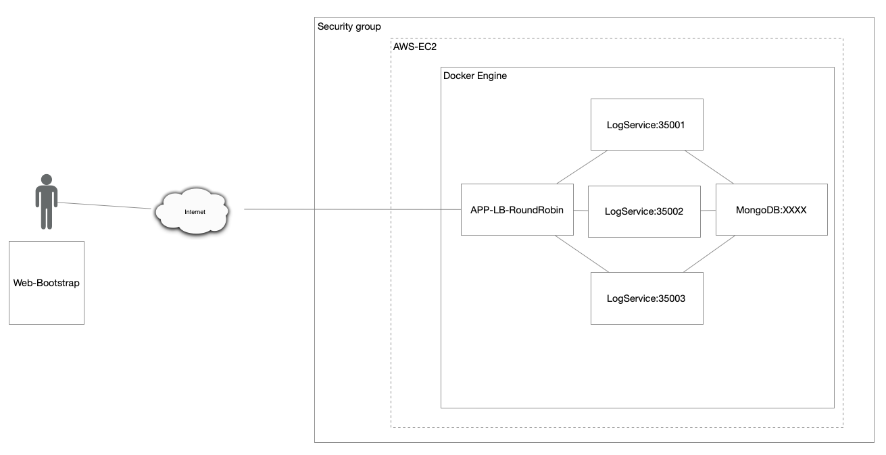
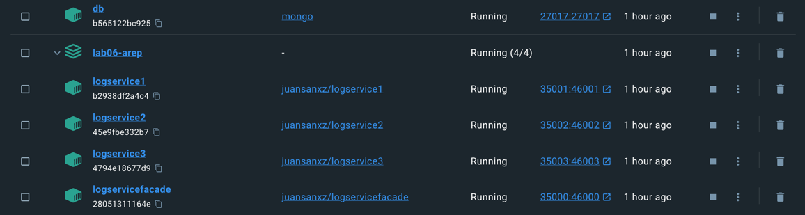
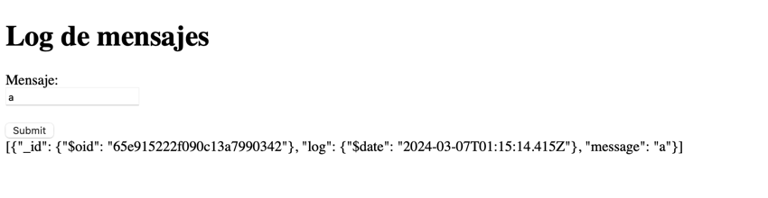
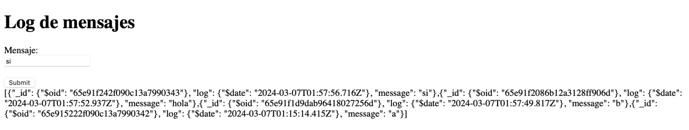
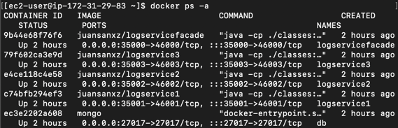
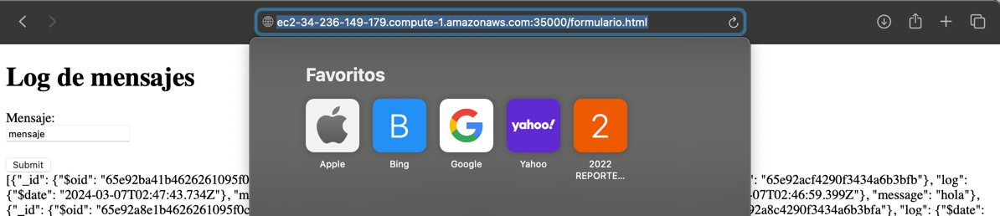

# TALLER DE TRABAJO INDIVIDUAL EN PATRONES ARQUITECTURALES
A continuación, se construirá una aplicación con la siguiente arquitectura, y se debe desplegar en AWS usando EC2 y Docker:  
  

## Autor
* **Juan Felipe Sánchez Pérez**

## Instalación y ejecución
### Prerequisitos

* Versión de Java: 17.
* La virtualización se hizo a través de una Mac con chip M1, por lo que para instanciar las imágenes que se darán a continuación en una instancia de EC2, debido a la arquitectura `linux/arm64/v8` usada, debería crearse una instancia con con una arquitectura de 64 bits (Arm) para que funcionen. Para el caso de Windows, saldrá una advertencia pero las imágenes podrán utilizarse.  

### Instalación y uso
1. Inicie Docker. Luego, abra la consola o la línea de comandos y ejecute el siguiente comando para crear una red de Docker, donde se conectarán los contenedores que se creen para que puedan interactuar entre sí:  
```
docker network create my_network
```  

2. Una vez creada la red, use el siguiente comando para crear un contenedor que tendrá la imagen de mongo, y se conecte a la red anteriormente especificada:
```
docker run -d --network=my_network -p 27017:27017 --name db mongo
```  

3. Ahora, cree los contenedores que fueron creados para cumplir con los requerimientos de la arquitectura que se muestra en la primera imagen de este documento. Siga el orden designado:    
Contenedores para el servicio `LogService`, los cuáles son llamados de acuerdo con el balanceo de cargas Round Robin definido:  
```
docker run -d --network=my_network -p 35001:46001 --name logservice1 juansanxz/logservice1
```
```
docker run -d --network=my_network -p 35002:46002 --name logservice2 juansanxz/logservice2
```
```
docker run -d --network=my_network -p 35003:46003 --name logservice3 juansanxz/logservice3
```  
Contenedor para el sercicio fachada `LogServiceFacade`:  
```
docker run -d --network=my_network -p 35000:46000 --name logservicefacade juansanxz/logservicefacade
```

4. Una vez creados los contenedores con las imágenes de docker hub, se obeservará en docker algo similar:  
  

5. ingrese a la URL `http://localhost:35000/formulario.html` y compruebe el funcionamiento de la aplicación:  
Ingrese un mensaje, y haga click en el botón, para traer los últimos 10 mensajes almacenados en la base de datos, y la hora en que fueron guardados.  
  
  


## Decisiones de diseño
La arquitectura que se diseñó e implementó para este laboratorio, cumpliendo con lo requerido, está compuesta por:  
* Servidor fachada que usa Spark para atender las solicitudes del cliente Web, representado por la clase `LogServerFacade.java`. En este, se establecen las URL de las instancias del servicio `LogService` (que estan en otros contenedores corriendo respectivamente), y se hace un llamado a la clase `RemoteLogServiceInvoker.java`, que se encarga de invokar a los servicios a través de la implementación del algoritmo de balanceo de cargas Round Robin.
  * Las URL son definidas en un arreglo, donde se indica el nombre de host y el puerto por el que oyen los contenedores que ejecutan y ofrecen el servicio expuesto por `LogService.java`:  
  ```
    private static final String[] LOG_SERVICE_URL = {"http://logservice1:46001/logservice", "http://logservice2:46002/logservice", "http://logservice3:46003/logservice"};
  ```  
  * El arreglo anterior es enviado a la clase `RemoteLogServiceInvoker.java` para que envíe la solicitud al contenedor correspondiente.  
  
* Tres componentes que ejecutan la clase `LogService.java`, la cual se encarga de almacenar en la base de datos el mensaje enviado, y mostrar los últimos 10 que se han gaurdado; todo esto usando la clase `LogDAO.java`, que se encarga de interactuar con la base de datos.  
* Instancia de MongoDB corriendo en un contenedor.

Para el proceso de virtualización:
* Se crearon tres archivos Dockerfile,  para la creación de las imagenes de los contenedores que ejecutan el método main de la clase `LogService.java`. En cada uno se define mediante una variable de entorno, el puerto por el que va a recibir las peticiones.
* Se creó un archivo Dockerfile para el servidor fachada, representado por la clase `LogServerFacade.java`.
* Se definió un archivo `docker-compose.yml`, que se encarga de crear una red virtual en la que se encuentran los contenedores con las imágenes definidas anteriormente.

## Despliegue
Para realizar el despliegue, se creó una instancia de EC2 en amazon, con la imagen del sistema operativo Linux y con una arquitectura de 64 bits (Arm). Posteriormente, se estableció una conexión mediante el protocolo _SSH_, y se crearon los contenedores, tal como se indica en la seccion _Intalación y uso_.  
Una vez instanciados los contenedores, al ejecutar el comando `docker ps -a` deberá observar que se crearon exitosamente:  
  
Luego de agregar una regla de entrada en el grupo de seguridad para permitir el tráfico por el puerto _35000_, ingresamos la URL compuesta por el dominio de la instancia de EC2 y el puerto indicado anteriormente, junto al recurso que se desea solicitar, comprobando el funcionamiento adecuado del despliegue:  
  
En el siguiente video, se observa el despliegue hecho de forma exitosa, y el funcionamiento del algoritmo de balanceo de carga Round Robin. 
Primero, se envía el mensaje `1`, y con ayuda del comando `docker logs logservice1`, se determina que fue esta instancia la que se encargó de atender la solicitud. Posteriormente, al enviar el mensaje `2`, nuevamente se ejecuta el comando pero ahora para revisar los logs del contenedor `logservice2`, evidenciando que fue este quien recibió y atendió la petición. Lo mismo sucede con la instancia `logservice3`. Viendo esto, se comprueba que el despliegue se realizó satisfactoriamente, y que se implementó adecuadamente el algoritmo de balanceo de carga Round Robin.  
[](https://youtu.be/-6VPw1sdyl8?si=6KgENaIJyFlmbDrJ)


## Build
* Maven - Administración de dependencias

## Versión
1.0

